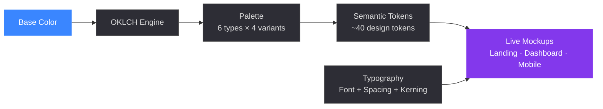

# Primer

**`primer.revanth.design`**

A design token synthesizer and contextual mockup engine built on perceptual color science.
Generate production-ready color systems, pair typography, and preview everything in live UI mockups — from a single base color.

---

## Why "Primer"

A primer is the foundational text you read before anything else. In paint, a primer is the first layer applied before any color — the surface that makes everything else possible. A design token system serves the same role: it is the primer for an entire product's visual identity. Every button color, every surface shade, every contrast ratio traces back to the decisions encoded in the primer.

The name pairs with `cinecode.revanth.design` to establish a portfolio of precision design tools.

---

## Product Pipeline



A single color input flows through the OKLCH perceptual engine, expands into a harmonious palette, maps to a full semantic token set, and is rendered live in three mockup templates — all while typography settings are applied in parallel.

---

## Information Architecture

```mermaid
graph TD
    subgraph SIDEBAR["◀ Sidebar · The Workshop"]
        direction TB
        TAB["Color │ Typography"]
        
        subgraph COLOR_TAB["Color Tab"]
            direction TB
            INPUT["Color Input\nText · Eyedropper · History · URL"]
            SPACE["Color Space Selector\nOKLCH · LCH · OKLAB · LAB · P3 · HSL · RGB · HEX"]
            SLIDERS["Channel Sliders\nLightness · Chroma · Hue (adapts per space)"]
            PTYPE["Palette Type\nAnalogous · Complementary · Split · Triadic · Tetradic · Tints&Shades"]
            VARIANT["Variant\nSquare · Triangle · Circle · Diamond"]
            FX["Effects\nVibrance · Warmth · Contrast · Blend"]
            TOOLS["Tools\nDetails · History · Theme"]
            EXPORT["Export\nPNG · CSS · Copy · Link · Shuffle · Help"]
        end
        
        subgraph TYPO_TAB["Typography Tab"]
            direction TB
            FONTS["Font Picker\nHeadings · Body (1500+ Google Fonts)"]
            SETTINGS["Settings\nLetter Spacing · Line Height · Kerning · Ligatures"]
            PREVIEW["Live Type Preview"]
        end
    end
    
    subgraph CANVAS["Canvas · The Preview ▶"]
        direction TB
        MODE["Palette │ UI Tokens │ Mockups"]
        
        PAL["Palette Mode\nColor Wheel · Vibrancy Bar · Swatches"]
        UI["UI Tokens Mode\nSemantic Grid (~40 tokens)"]
        MOCK["Mockups Mode\nLanding Page · Dashboard · Mobile App"]
    end
    
    style SIDEBAR fill:#1a1a22,stroke:#333,color:#eee
    style CANVAS fill:#1a1a22,stroke:#333,color:#eee
    style COLOR_TAB fill:#22222a,stroke:#444,color:#ddd
    style TYPO_TAB fill:#22222a,stroke:#444,color:#ddd
```



The application is divided into two functional zones. The **Sidebar** is the command surface — every input, slider, and selector lives here. The **Canvas** is the observation surface — it renders the output of those decisions in real-time, across three preview modes.

---

## The Three Modes

### 1. Palette Mode — Explore

The entry point. A base color is decomposed into a harmonious palette using color theory:

| Algorithm | Code | Description |
|---|---|---|
| Analogous | `ANA` | Adjacent colors on the wheel — natural harmony |
| Complementary | `COM` | Opposite colors — maximum contrast |
| Split Complementary | `SPL` | Base + two colors adjacent to its complement |
| Triadic | `TRI` | Three evenly spaced colors |
| Tetradic | `TET` | Four colors forming a rectangle |
| Tints & Shades | `TAS` | Lighter and darker variations of one hue |

Each algorithm has **four geometric variants** (Square, Triangle, Circle, Diamond) that alter the angular spread and lightness distribution.

The palette is visualized as:
- **Color Wheel** — SVG polar plot; colors positioned by hue angle and saturation radius, animated with CSS transitions
- **Vibrancy Bar** — Full-width gradient interpolated across all palette colors in the active color space
- **Interactive Swatches** — Click any swatch to copy its value

### 2. UI Tokens Mode — Systematize

The palette expands into **~40 semantic design tokens** following Material Design 3 conventions:

```
┌──────────┬──────────────┬──────────────────────┐
│ surface  │ on-surface   │ on-surface-variant   │
├──────────┼──────────────┼──────────────────────┤
│container │container-sunk│ container-overlay     │
├──────────┴──────────────┼──────────────────────┤
│ outline                 │ outline-variant       │
├────────┬────────┬───────┴──┬───────────────────┤
│primary │on-prim │prim-cont │on-prim-container  │
├────────┼────────┼──────────┼───────────────────┤
│second  │on-sec  │sec-cont  │on-sec-container   │
├────────┼────────┼──────────┼───────────────────┤
│tertiary│on-tert │tert-cont │on-tert-container  │
├────────┴────────┼──────────┴───────────────────┤
│inverse-surface  │ on-inverse-surface           │
├────────┬────────┼──────────┬───────────────────┤
│ error  │on-err  │err-cont  │on-err-container   │
├────────┼────────┼──────────┼───────────────────┤
│success │on-succ │succ-cont │on-succ-container  │
├────────┼────────┼──────────┼───────────────────┤
│warning │on-warn │warn-cont │on-warn-container  │
└────────┴────────┴──────────┴───────────────────┘
```

Tokens are displayed in a weighted grid — surface tokens span wider columns to communicate their semantic dominance. Click any token to copy its CSS value.

### 3. Mockups Mode — Validate

Tokens are injected as live CSS custom properties into three interactive mockup templates:

| Mockup | Tests | Components |
|---|---|---|
| **Landing Page** | High-contrast, marketing layouts | Nav bar, hero section, CTAs, feature cards, social proof, stats strip |
| **Dashboard** | Information-dense, utility layouts | Sidebar nav, stat cards, bar charts, data table with status pills |
| **Mobile App** | Compact, touch-oriented layouts | iOS status bar, Dynamic Island, message list, avatars, FAB, tab bar |

All mockups respond in real-time to color changes, effect adjustments, font selections, and typography tuning.

---

## The Control Surface

### Color Input

Five ways to set a base color:

| Method | Interaction |
|---|---|
| Text input | Type any CSS color string: `oklch(0.7 0.15 240)`, `#3a86ff`, `hsl(220 80% 60%)` |
| Eyedropper | Browser EyeDropper API — pick any pixel on screen |
| Color history | 240-cell grid of previously used colors (persisted in `localStorage`) |
| Random | Shuffle to a new random color |
| URL | Full state encoded in URL parameters for sharing |

### Color Spaces

Eight color spaces, each with dedicated channel sliders:

| Space | Channels | Character |
|---|---|---|
| `OKLCH` | Lightness · Chroma · Hue | Perceptually uniform — best for design |
| `LCH` | Lightness · Chroma · Hue | CIE wide-gamut perceptual |
| `OKLAB` | Lightness · a · b | Perceptually uniform Lab |
| `LAB` | Lightness · a · b | Device-independent CIE |
| `P3` | R · G · B | Wide gamut (Apple displays) |
| `HSL` | Hue · Saturation · Lightness | Intuitive but not perceptually uniform |
| `RGB` | R · G · B | Standard web model |
| `HEX` | — | Hexadecimal notation |

Selecting a space updates three things simultaneously: the slider channels adapt, the color input reformats, and the active format is highlighted in the hero section's format grid.

### Effects Engine

Four post-processing effects, each 0–100:

| Effect | Function |
|---|---|
| **Vibrance** | Increases saturation of muted colors while preserving vivid ones |
| **Warmth** | Shifts hue toward amber (warm) or blue (cool) |
| **Contrast** | Expands lightness range between lightest and darkest |
| **Blend** | Mixes colors toward a common midpoint for cohesion |

### Typography System

| Control | Range | Purpose |
|---|---|---|
| Heading font | 1,500+ Google Fonts | Primary typeface for headings in mockups |
| Body font | 1,500+ Google Fonts | Secondary typeface for body text |
| Letter spacing | `-0.1em` — `0.3em` | Track width |
| Line height | `1.0×` — `2.5×` | Vertical rhythm |
| Kerning | Auto · Normal · None | Character pair spacing |
| Ligatures | On · Off | OpenType ligature features |

The font picker uses **virtualized rendering** (`react-window`) — only ~8 rows exist in the DOM at any time. Fonts are filterable by category (Sans, Serif, Display, Script, Mono) and searchable by name.

### Export

Six actions in a unified 3×2 grid:

| | | |
|---|---|---|
| Download PNG | Download CSS | Copy CSS |
| Copy Link | Shuffle | Help |

---

## Hero Section Anatomy

In Palette mode, the hero block contains:

```
┌─────────────────────────────────────────────────────────────────┐
│                                                                 │
│  ● Coral Sunset                              ╭──── Color ────╮ │
│    in Warm Autumn Palette                     │   Wheel SVG   │ │
│                                               │  (polar plot)  │ │
│  ┌─────────────────────────────────┐          │   ◉   ◉   ◉   │ │
│  │ 📋 OKLCH   0.7 0.15 240        │          ╰───────────────╯ │
│  │ 📋 LCH     70 38 240           │                            │
│  │ 📋 OKLAB   0.7 -0.05 -0.14     │                            │
│  │ 📋 LAB     70 -12 -35          │                            │
│  │ 📋 P3      0.32 0.55 0.89      │                            │
│  │ 📋 HSL     220 80% 60%         │                            │
│  │ 📋 RGB     31% 53% 100%        │                            │
│  │ 📋 HEX     #3a86ff             │                            │
│  └─────────────────────────────────┘                            │
│                                                                 │
│  ▓▓▓▓▓▓▓▓▓▓▓▓▓▓▓▓▓▓▓▓▓▓▓▓▓▓▓▓▓▓▓▓▓▓▓▓  ← Vibrancy Bar       │
│                                                                 │
│  ◯ Analogous    ◯ Square Variant    ◯ No Effects  ← Chips      │
│                                                                 │
└─────────────────────────────────────────────────────────────────┘
```

---

## Display Capabilities Bar

The sidebar footer detects and displays the user's monitor:

| Indicator | Values | Why it matters |
|---|---|---|
| Color Gamut | sRGB · P3 · Rec.2020 | OKLCH colors may exceed what the monitor renders |
| Spectrum Coverage | 35% · 45% · 63% | How much of the visible spectrum the display covers |
| Dynamic Range | HDR · SDR | Affects how gradients and subtle lightness shifts appear |

This bar doubles as a **toast notification surface** — copy confirmations and error messages temporarily replace the display info with animated feedback.

---

## Technical Stack

| Layer | Technology | Role |
|---|---|---|
| Framework | React 19 + TypeScript | Component architecture |
| Color Engine | `primer` (wraps Color.js) | Perceptual color math |
| Animation | Motion (Framer Motion) | Layout transitions |
| SVG Animation | Raw CSS transitions | Color wheel performance |
| Font Loading | Google Fonts API | Dynamic `<link>` injection with caching |
| Virtualization | `react-window` | Font dropdown (1,500+ items) |
| State Sharing | URL parameter encoding | Full palette state serialization |
| Persistence | `localStorage` | Color history (240 entries) + dark mode |
| Brand Font | Fraunces (Google Fonts) | Italic serif wordmark |

---

## Acknowledgments

- **[Color.js](https://github.com/color-js/color.js)** by Lea Verou & Chris Lilley — the color science engine
- **[Color Name API](https://github.com/meodai/color-name-api)** by David Aerne — REST API for color naming
- **[Fraunces](https://github.com/undercasetype/Fraunces)** by Undercase Type — the brand typeface

## License

MIT — see [LICENSE](LICENSE) for details.
